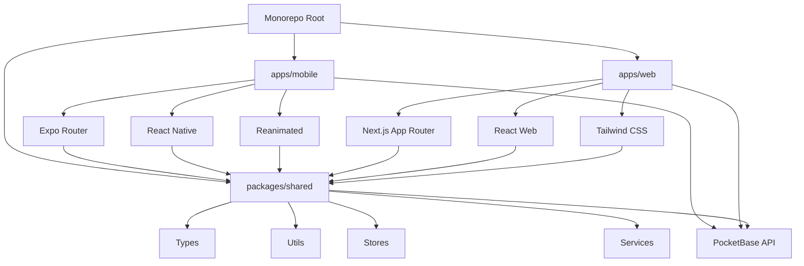

I have created the following plan after thorough exploration and analysis of the codebase. Follow the below plan verbatim. Trust the files and references. Do not re-verify what's written in the plan. Explore only when absolutely necessary. First implement all the proposed file changes and then I'll review all the changes together at the end.

## Observations

The workspace at `file:darwin/` is currently empty except for a Numbers spreadsheet, providing a clean slate for a monorepo project. Based on current best practices (Expo SDK 52+, January 2026), the recommended approach uses a monorepo structure with separate mobile and web applications sharing common code. The mobile app uses Expo Router for file-based navigation with TypeScript, while the web app uses Next.js for server-side rendering and optimal web performance. Both applications will share business logic, types, and utilities through a common `/packages/shared` directory. Configuration will be production-ready from the start with strict TypeScript, comprehensive linting, environment variable management for dev/staging/production, and proper permissions setup.

## Approach

The implementation follows a monorepo pattern using npm workspaces, separating the mobile app (`/apps/mobile`) and web app (`/apps/web`) while maintaining shared code in `/packages/shared`. The mobile app leverages Expo's latest conventions with Expo Router and TypeScript pre-configured. The web app uses Next.js 15+ with App Router for modern React patterns and server-side capabilities. Both applications share a common configuration, types, utilities, and services layer, reducing code duplication and ensuring consistency. Configuration will be production-ready from the start with strict TypeScript, comprehensive linting, environment variable management for dev/staging/production, and proper setup for both platforms.

## Implementation Steps

### 1. Initialize Monorepo Structure with npm Workspaces

Navigate to the workspace directory and set up the monorepo root:

```bash
cd /Users/mac/GitHubLocal/darwin
npm init -y
```

Update `file:package.json` to configure npm workspaces:

```json
{
  "name": "darwin-principle",
  "version": "1.0.0",
  "description": "The Darwin Principle - Competitive mobile and web game",
  "private": true,
  "workspaces": [
    "apps/mobile",
    "apps/web",
    "packages/shared"
  ],
  "scripts": {
    "dev": "npm run dev --workspaces",
    "build": "npm run build --workspaces",
    "lint": "npm run lint --workspaces",
    "type-check": "npm run type-check --workspaces",
    "format": "prettier --write \"**/*.{ts,tsx,json,md}\"",
    "format:check": "prettier --check \"**/*.{ts,tsx,json,md}\""
  },
  "devDependencies": {
    "prettier": "^3.2.5",
    "typescript": "^5.3.3"
  }
}
```

Create the monorepo directory structure:

```bash
mkdir -p apps/mobile apps/web packages/shared
```

### 2. Initialize Mobile App (Expo)

Navigate to the mobile app directory and create a new Expo project:

```bash
cd apps/mobile
npx create-expo-app@latest . --template default
```

This initializes the mobile app with:
- Expo Router pre-configured with `/app` directory
- TypeScript enabled by default
- Basic `app.json` configuration
- Metro bundler configuration
- Initial `package.json` with core dependencies

### 3. Create Mobile App Folder Structure

Establish the `/src` directory structure alongside the existing `/app` routing directory in `apps/mobile/`:

```
apps/mobile/
├── app/                          # Expo Router file-based routing
│   ├── _layout.tsx              # Root layout
│   └── index.tsx                # Home route
├── src/
│   ├── components/              # Reusable UI components
│   │   └── .gitkeep
│   ├── screens/                 # Screen components (used by routes)
│   │   └── .gitkeep
│   ├── services/                # API clients, external integrations
│   │   └── .gitkeep
│   ├── utils/                   # Helper functions, formatters
│   │   └── .gitkeep
│   ├── config/                  # App configuration, constants
│   │   └── .gitkeep
│   ├── stores/                  # Zustand state management stores
│   │   └── .gitkeep
│   └── hooks/                   # Custom React hooks
│       └── .gitkeep
├── assets/                      # Images, fonts, sounds
└── ...
```

Create these directories and add `.gitkeep` files to ensure they're tracked by Git.

### 4. Initialize Web App (Next.js)

Navigate to the web app directory and create a new Next.js project:

```bash
cd ../../apps/web
npx create-next-app@latest . --typescript --tailwind --app --no-git --no-eslint
```

This initializes the web app with:
- Next.js 15+ with App Router
- TypeScript enabled
- Tailwind CSS for styling
- React Server Components support

Create the web app folder structure:

```
apps/web/
├── app/                         # Next.js App Router
│   ├── layout.tsx              # Root layout
│   ├── page.tsx                # Home page
│   └── ...
├── src/
│   ├── components/             # Reusable UI components
│   │   └── .gitkeep
│   ├── pages/                  # Page components (if needed)
│   │   └── .gitkeep
│   ├── services/               # API clients, external integrations
│   │   └── .gitkeep
│   ├── utils/                  # Helper functions, formatters
│   │   └── .gitkeep
│   ├── config/                 # App configuration, constants
│   │   └── .gitkeep
│   ├── stores/                 # Zustand state management stores
│   │   └── .gitkeep
│   └── hooks/                  # Custom React hooks
│       └── .gitkeep
├── public/                     # Static assets
└── ...
```

### 5. Create Shared Package

Navigate to the shared package directory and initialize it:

```bash
cd ../../packages/shared
npm init -y
```

Update `file:packages/shared/package.json`:

```json
{
  "name": "@darwin/shared",
  "version": "1.0.0",
  "description": "Shared code for Darwin Principle mobile and web apps",
  "private": true,
  "main": "dist/index.js",
  "types": "dist/index.d.ts",
  "scripts": {
    "build": "tsc",
    "type-check": "tsc --noEmit"
  },
  "dependencies": {
    "zustand": "^4.4.7"
  },
  "devDependencies": {
    "typescript": "^5.3.3"
  }
}
```

Create the shared package folder structure:

```
packages/shared/
├── src/
│   ├── types/                  # Shared TypeScript types
│   │   ├── index.ts
│   │   ├── user.ts
│   │   ├── game.ts
│   │   └── api.ts
│   ├── utils/                  # Shared utility functions
│   │   ├── index.ts
│   │   ├── validators.ts
│   │   ├── formatters.ts
│   │   └── constants.ts
│   ├── stores/                 # Shared Zustand stores
│   │   ├── index.ts
│   │   └── authStore.ts
│   ├── services/               # Shared API services
│   │   ├── index.ts
│   │   └── pocketbaseClient.ts
│   └── config/                 # Shared configuration
│       ├── index.ts
│       └── gameConfig.ts
├── tsconfig.json
└── package.json
```

Create `file:packages/shared/tsconfig.json`:

```json
{
  "compilerOptions": {
    "target": "ES2020",
    "module": "ESNext",
    "lib": ["ES2020"],
    "declaration": true,
    "outDir": "./dist",
    "rootDir": "./src",
    "strict": true,
    "esModuleInterop": true,
    "skipLibCheck": true,
    "forceConsistentCasingInFileNames": true,
    "resolveJsonModule": true,
    "moduleResolution": "node"
  },
  "include": ["src"],
  "exclude": ["node_modules", "dist"]
}
```

Create `file:packages/shared/src/index.ts` as the entry point:

```typescript
// Export all shared types, utils, stores, and services
export * from './types';
export * from './utils';
export * from './stores';
export * from './services';
export * from './config';
```

### 6. Configure Mobile App (app.json)

Update `file:apps/mobile/app.json` with production-ready configuration:

**Key configurations to add/modify:**
- **name**: "The Darwin Principle"
- **slug**: "darwin-principle"
- **version**: "1.0.0"
- **orientation**: "portrait"
- **icon**: "./assets/icon.png" (placeholder, to be replaced)
- **splash**: Configure splash screen with app branding
- **ios.bundleIdentifier**: "com.darwinprinciple.app" (adjust to your organization)
- **android.package**: "com.darwinprinciple.app"
- **android.permissions**: Add `["CAMERA", "READ_EXTERNAL_STORAGE", "WRITE_EXTERNAL_STORAGE"]` for profile picture upload
- **ios.infoPlist**: Add camera usage description: `"NSCameraUsageDescription": "Upload your profile picture"`
- **notification permissions**: Add `"expo-notifications"` plugin configuration
- **experiments.typedRoutes**: Set to `true` for type-safe routing

Example structure:
```json
{
  "expo": {
    "name": "The Darwin Principle",
    "slug": "darwin-principle",
    "version": "1.0.0",
    "orientation": "portrait",
    "icon": "./assets/icon.png",
    "userInterfaceStyle": "automatic",
    "splash": {
      "image": "./assets/splash.png",
      "resizeMode": "contain",
      "backgroundColor": "#ffffff"
    },
    "ios": {
      "bundleIdentifier": "com.darwinprinciple.app",
      "supportsTablet": true,
      "infoPlist": {
        "NSCameraUsageDescription": "Upload your profile picture for The Darwin Principle"
      }
    },
    "android": {
      "package": "com.darwinprinciple.app",
      "adaptiveIcon": {
        "foregroundImage": "./assets/adaptive-icon.png",
        "backgroundColor": "#ffffff"
      },
      "permissions": [
        "CAMERA",
        "READ_EXTERNAL_STORAGE",
        "WRITE_EXTERNAL_STORAGE"
      ]
    },
    "plugins": [
      "expo-router",
      [
        "expo-notifications",
        {
          "icon": "./assets/notification-icon.png",
          "color": "#ffffff"
        }
      ]
    ],
    "experiments": {
      "typedRoutes": true
    }
  }
}
```

### 7. Install Mobile App Dependencies

Install all required packages using Expo's installation command to ensure compatibility:

```bash
cd /Users/mac/GitHubLocal/darwin/apps/mobile
npx expo install zustand react-native-reanimated react-native-worklets
npx expo install @react-navigation/native
npx expo install expo-notifications expo-image-picker expo-av
npx expo install @darwin/shared
```

**Dependency breakdown:**
- `zustand`: Lightweight state management
- `react-native-reanimated` + `react-native-worklets`: High-performance animations
- `@react-navigation/native`: Navigation utilities (works with Expo Router)
- `expo-notifications`: Push notification support
- `expo-image-picker`: Profile picture upload
- `expo-av`: Win movie video playback
- `@darwin/shared`: Shared code package

### 8. Install Web App Dependencies

Install all required packages for the Next.js web app:

```bash
cd /Users/mac/GitHubLocal/darwin/apps/web
npm install zustand axios
npm install --save-dev @darwin/shared
```

**Dependency breakdown:**
- `zustand`: Lightweight state management (shared with mobile)
- `axios`: HTTP client for API calls
- `@darwin/shared`: Shared code package

### 9. Configure React Native Reanimated (Mobile)

Update `file:apps/mobile/babel.config.js` to include the Reanimated plugin (must be last):

```javascript
module.exports = function(api) {
  api.cache(true);
  return {
    presets: ['babel-preset-expo'],
    plugins: [
      'react-native-reanimated/plugin', // Must be last
    ],
  };
};
```

Create or update `file:metro.config.js` to wrap with Reanimated Metro config:

```javascript
const { getDefaultConfig } = require('expo/metro-config');
const { wrapWithReanimatedMetroConfig } = require('react-native-reanimated/metro-config');

const config = getDefaultConfig(__dirname);

module.exports = wrapWithReanimatedMetroConfig(config);
```

### 10. Set Up TypeScript Strict Mode (Mobile)

Update `file:apps/mobile/tsconfig.json` to enable strict type checking:

```json
{
  "extends": "expo/tsconfig.base",
  "compilerOptions": {
    "strict": true,
    "strictNullChecks": true,
    "strictFunctionTypes": true,
    "strictBindCallApply": true,
    "strictPropertyInitialization": true,
    "noImplicitAny": true,
    "noImplicitThis": true,
    "alwaysStrict": true,
    "noUnusedLocals": true,
    "noUnusedParameters": true,
    "noImplicitReturns": true,
    "noFallthroughCasesInSwitch": true,
    "esModuleInterop": true,
    "skipLibCheck": true,
    "resolveJsonModule": true,
    "baseUrl": ".",
    "paths": {
      "@/*": ["src/*"],
      "@components/*": ["src/components/*"],
      "@screens/*": ["src/screens/*"],
      "@services/*": ["src/services/*"],
      "@types/*": ["src/types/*"],
      "@utils/*": ["src/utils/*"],
      "@config/*": ["src/config/*"],
      "@stores/*": ["src/stores/*"],
      "@hooks/*": ["src/hooks/*"]
    }
  },
  "include": [
    "**/*.ts",
    "**/*.tsx",
    ".expo/types/**/*.ts",
    "expo-env.d.ts"
  ],
  "exclude": [
    "node_modules"
  ]
}
```

Run the TypeScript configuration customization:
```bash
npx expo customize tsconfig.json
```

### 11. Configure ESLint and Prettier (Root Level)

Install ESLint and Prettier dependencies at the root:

```bash
cd /Users/mac/GitHubLocal/darwin
npm install --save-dev eslint prettier eslint-config-expo eslint-config-prettier eslint-plugin-prettier @typescript-eslint/eslint-plugin @typescript-eslint/parser eslint-config-next
```

Create `file:.eslintrc.js` at the root:

```javascript
module.exports = {
  extends: [
    'expo',
    'eslint:recommended',
    'plugin:@typescript-eslint/recommended',
    'prettier'
  ],
  parser: '@typescript-eslint/parser',
  parserOptions: {
    ecmaVersion: 2021,
    sourceType: 'module',
    project: './tsconfig.json'
  },
  plugins: ['@typescript-eslint', 'prettier'],
  rules: {
    'prettier/prettier': 'error',
    '@typescript-eslint/no-unused-vars': ['error', { argsIgnorePattern: '^_' }],
    '@typescript-eslint/explicit-module-boundary-types': 'off',
    '@typescript-eslint/no-explicit-any': 'warn'
  },
  ignorePatterns: ['.expo', 'node_modules', 'babel.config.js', 'metro.config.js']
};
```

Create `file:.prettierrc`:

```json
{
  "semi": true,
  "trailingComma": "es5",
  "singleQuote": true,
  "printWidth": 100,
  "tabWidth": 2,
  "useTabs": false,
  "arrowParens": "avoid",
  "endOfLine": "lf"
}
```

Create `file:.eslintignore`:

```
node_modules/
.expo/
dist/
build/
*.config.js
```

Create `file:.prettierignore`:

```
node_modules/
.expo/
dist/
build/
package-lock.json
yarn.lock
```

Add scripts to `file:package.json`:

```json
{
  "scripts": {
    "start": "expo start",
    "android": "expo start --android",
    "ios": "expo start --ios",
    "web": "expo start --web",
    "lint": "eslint . --ext .ts,.tsx",
    "lint:fix": "eslint . --ext .ts,.tsx --fix",
    "format": "prettier --write \"**/*.{ts,tsx,json,md}\"",
    "format:check": "prettier --check \"**/*.{ts,tsx,json,md}\"",
    "type-check": "tsc --noEmit"
  }
}
```

### 12. Create Environment Configuration Files

Create environment variable files for different deployment stages at the root:

**Create `file:.env.development`:**
```
EXPO_PUBLIC_ENV=development
EXPO_PUBLIC_API_URL=http://localhost:8090
EXPO_PUBLIC_APP_NAME=Darwin Principle (Dev)
NEXT_PUBLIC_API_URL=http://localhost:8090
NEXT_PUBLIC_APP_NAME=Darwin Principle (Dev)
```

**Create `file:.env.staging`:**
```
EXPO_PUBLIC_ENV=staging
EXPO_PUBLIC_API_URL=https://staging-api.darwinprinciple.com
EXPO_PUBLIC_APP_NAME=Darwin Principle (Staging)
NEXT_PUBLIC_API_URL=https://staging-api.darwinprinciple.com
NEXT_PUBLIC_APP_NAME=Darwin Principle (Staging)
```

**Create `file:.env.production`:**
```
EXPO_PUBLIC_ENV=production
EXPO_PUBLIC_API_URL=https://api.darwinprinciple.com
EXPO_PUBLIC_APP_NAME=The Darwin Principle
NEXT_PUBLIC_API_URL=https://api.darwinprinciple.com
NEXT_PUBLIC_APP_NAME=The Darwin Principle
```

**Create `file:.env.local`** (for local overrides, add to `.gitignore`):
```
# Local environment overrides
# This file is ignored by git
```

Update `file:.gitignore` to include:
```
.env.local
.env*.local
.next/
dist/
build/
```

### 13. Create Dynamic Mobile App Configuration

Convert `file:apps/mobile/app.json` to `file:apps/mobile/app.config.js` for dynamic environment-based configuration:

```javascript
const IS_DEV = process.env.EXPO_PUBLIC_ENV === 'development';
const IS_STAGING = process.env.EXPO_PUBLIC_ENV === 'staging';
const IS_PROD = process.env.EXPO_PUBLIC_ENV === 'production';

const getAppName = () => {
  if (IS_DEV) return 'Darwin Principle (Dev)';
  if (IS_STAGING) return 'Darwin Principle (Staging)';
  return 'The Darwin Principle';
};

const getBundleIdentifier = () => {
  if (IS_DEV) return 'com.darwinprinciple.app.dev';
  if (IS_STAGING) return 'com.darwinprinciple.app.staging';
  return 'com.darwinprinciple.app';
};

export default {
  expo: {
    name: getAppName(),
    slug: 'darwin-principle',
    version: '1.0.0',
    orientation: 'portrait',
    icon: './assets/icon.png',
    userInterfaceStyle: 'automatic',
    splash: {
      image: './assets/splash.png',
      resizeMode: 'contain',
      backgroundColor: '#ffffff',
    },
    ios: {
      bundleIdentifier: getBundleIdentifier(),
      supportsTablet: true,
      infoPlist: {
        NSCameraUsageDescription: 'Upload your profile picture for The Darwin Principle',
      },
    },
    android: {
      package: getBundleIdentifier(),
      adaptiveIcon: {
        foregroundImage: './assets/adaptive-icon.png',
        backgroundColor: '#ffffff',
      },
      permissions: ['CAMERA', 'READ_EXTERNAL_STORAGE', 'WRITE_EXTERNAL_STORAGE'],
    },
    plugins: [
      'expo-router',
      [
        'expo-notifications',
        {
          icon: './assets/notification-icon.png',
          color: '#ffffff',
        },
      ],
    ],
    experiments: {
      typedRoutes: true,
    },
    extra: {
      apiUrl: process.env.EXPO_PUBLIC_API_URL,
      environment: process.env.EXPO_PUBLIC_ENV,
    },
  },
};
```

### 14. Create Shared Configuration Files

**Create `file:packages/shared/src/config/gameConfig.ts`:**
```typescript
import Constants from 'expo-constants';

export const APP_CONFIG = {
  apiUrl: process.env.EXPO_PUBLIC_API_URL || 'http://localhost:8090',
  environment: process.env.EXPO_PUBLIC_ENV || 'development',
  appName: Constants.expoConfig?.name || 'The Darwin Principle',
} as const;

export const GAME_CONFIG = {
  initialGenesPurchase: 2500,
  initialGenesCost: 25, // EUR
  encounterCost: 100,
  winnerGeneReward: 75,
  loserGenePenalty: 100,
  maxLevel: 10,
  levelCapacities: {
    1: 1024,
    2: 512,
    3: 256,
    4: 128,
    5: 64,
    6: 32,
    7: 16,
    8: 8,
    9: 4,
    10: 2,
  },
} as const;
```

**Create `file:src/types/index.ts`:**
```typescript
// Global type definitions
export type Environment = 'development' | 'staging' | 'production';

export interface User {
  id: string;
  email: string;
  gameName: string;
  profilePicture: string;
  geneBalance: number;
  currentLevel: number;
  wins: number;
  losses: number;
}

// Additional types will be added by subsequent phases
```

### 15. Create Initial Configuration Files (Mobile)

**Create `file:apps/mobile/src/config/constants.ts`:**
```typescript
import Constants from 'expo-constants';

export const APP_CONFIG = {
  apiUrl: process.env.EXPO_PUBLIC_API_URL || 'http://localhost:8090',
  environment: process.env.EXPO_PUBLIC_ENV || 'development',
  appName: Constants.expoConfig?.name || 'The Darwin Principle',
} as const;
```

### 16. Create Initial Configuration Files (Web)

**Create `file:apps/web/src/config/constants.ts`:**
```typescript
export const APP_CONFIG = {
  apiUrl: process.env.NEXT_PUBLIC_API_URL || 'http://localhost:8090',
  environment: process.env.NODE_ENV || 'development',
  appName: process.env.NEXT_PUBLIC_APP_NAME || 'The Darwin Principle',
} as const;
```

### 17. Create Shared Types

**Create `file:packages/shared/src/types/index.ts`:**
```typescript
export type Environment = 'development' | 'staging' | 'production';

export interface User {
  id: string;
  email: string;
  gameName: string;
  profilePicture: string;
  geneBalance: number;
  currentLevel: number;
  wins: number;
  losses: number;
}

export interface Match {
  id: string;
  player1Id: string;
  player2Id: string;
  level: number;
  status: 'pending' | 'active' | 'completed';
  winner?: string;
  encounterId: string;
  startTime: Date;
  endTime?: Date;
}

export interface Encounter {
  id: string;
  type: string;
  difficulty: number;
  levelRequirement: number;
  config: Record<string, unknown>;
  scoring: Record<string, unknown>;
}
```

### 18. Create Shared Utilities

**Create `file:packages/shared/src/utils/constants.ts`:**
```typescript
export const GAME_CONFIG = {
  initialGenesPurchase: 2500,
  initialGenesCost: 25, // EUR
  encounterCost: 100,
  winnerGeneReward: 75,
  loserGenePenalty: 100,
  maxLevel: 10,
  levelCapacities: {
    1: 1024,
    2: 512,
    3: 256,
    4: 128,
    5: 64,
    6: 32,
    7: 16,
    8: 8,
    9: 4,
    10: 2,
  },
} as const;
```

### 19. Verify Installation and Configuration

Clear caches and start development servers:

**Mobile:**
```bash
cd /Users/mac/GitHubLocal/darwin/apps/mobile
npx expo start -c
```

**Web (in a new terminal):**
```bash
cd /Users/mac/GitHubLocal/darwin/apps/web
npm run dev
```

Run linting and type checking to verify setup:

```bash
cd /Users/mac/GitHubLocal/darwin
npm run lint
npm run type-check
npm run format:check
```

### 20. Create Initial Documentation

**Create `file:README.md`:**
```markdown
# The Darwin Principle

A competitive mobile game app where players duel in mini-game encounters to climb through 10 levels and win real money.

## Tech Stack

- **Framework**: Expo (SDK 52+)
- **Language**: TypeScript (Strict Mode)
- **Navigation**: Expo Router (File-based)
- **State Management**: Zustand
- **Animations**: React Native Reanimated
- **Backend**: PocketBase (Real-time)

## Getting Started

### Prerequisites

- Node.js 18+
- npm or yarn
- Expo CLI

### Installation

1. Clone the repository
2. Install dependencies: `npm install`
3. Start development server: `npm start`

### Available Scripts

- `npm start` - Start Expo development server
- `npm run android` - Run on Android
- `npm run ios` - Run on iOS
- `npm run lint` - Run ESLint
- `npm run lint:fix` - Fix ESLint errors
- `npm run format` - Format code with Prettier
- `npm run type-check` - Run TypeScript type checking

## Project Structure

```
darwin/
├── app/              # Expo Router file-based routing
├── src/
│   ├── components/   # Reusable UI components
│   ├── screens/      # Screen components
│   ├── services/     # API clients, integrations
│   ├── types/        # TypeScript definitions
│   ├── utils/        # Helper functions
│   ├── config/       # App configuration
│   ├── stores/       # Zustand stores
│   └── hooks/        # Custom React hooks
└── assets/           # Images, fonts, sounds
```

## Environment Variables

- `.env.development` - Development environment
- `.env.staging` - Staging environment
- `.env.production` - Production environment
- `.env.local` - Local overrides (not committed)

## License

Proprietary - All rights reserved
```

**Create `file:.nvmrc`** (optional, for Node version management):
```
18
```

```markdown
# The Darwin Principle

A competitive mobile and web game app where players duel in mini-game encounters to climb through 10 levels and win real money.

## Tech Stack

### Mobile App (Expo)
- **Framework**: Expo (SDK 52+)
- **Language**: TypeScript (Strict Mode)
- **Navigation**: Expo Router (File-based)
- **State Management**: Zustand
- **Animations**: React Native Reanimated
- **Backend**: PocketBase (Real-time)

### Web App (Next.js)
- **Framework**: Next.js 15+ (App Router)
- **Language**: TypeScript (Strict Mode)
- **Styling**: Tailwind CSS
- **State Management**: Zustand
- **HTTP Client**: Axios
- **Backend**: PocketBase (Real-time)

### Shared Code
- **Package**: @darwin/shared
- **Contents**: Types, utilities, stores, services, configuration

## Getting Started

### Prerequisites

- Node.js 18+
- npm or yarn
- Expo CLI (for mobile development)

### Installation

1. Clone the repository
2. Install dependencies: `npm install`
3. Start development servers:
   - Mobile: `cd apps/mobile && npx expo start`
   - Web: `cd apps/web && npm run dev`

### Available Scripts (Root)

- `npm run dev` - Start all development servers
- `npm run build` - Build all apps
- `npm run lint` - Run ESLint across all apps
- `npm run type-check` - Run TypeScript type checking
- `npm run format` - Format code with Prettier
- `npm run format:check` - Check code formatting

## Project Structure

```
darwin/
├── apps/
│   ├── mobile/                 # Expo mobile app
│   │   ├── app/               # Expo Router file-based routing
│   │   ├── src/
│   │   │   ├── components/
│   │   │   ├── screens/
│   │   │   ├── services/
│   │   │   ├── utils/
│   │   │   ├── config/
│   │   │   ├── stores/
│   │   │   └── hooks/
│   │   └── assets/
│   └── web/                    # Next.js web app
│       ├── app/               # Next.js App Router
│       ├── src/
│       │   ├── components/
│       │   ├── services/
│       │   ├── utils/
│       │   ├── config/
│       │   ├── stores/
│       │   └── hooks/
│       └── public/
├── packages/
│   └── shared/                 # Shared code (@darwin/shared)
│       └── src/
│           ├── types/
│           ├── utils/
│           ├── stores/
│           ├── services/
│           └── config/
├── .env.development
├── .env.staging
├── .env.production
├── .env.local
├── .eslintrc.js
├── .prettierrc
├── tsconfig.json
└── package.json
```

## Environment Variables

- `.env.development` - Development environment
- `.env.staging` - Staging environment
- `.env.production` - Production environment
- `.env.local` - Local overrides (not committed)

## Monorepo Workspaces

This project uses npm workspaces to manage multiple applications and shared code:

- `apps/mobile` - Expo mobile application
- `apps/web` - Next.js web application
- `packages/shared` - Shared code, types, and utilities

## License

Proprietary - All rights reserved
```

### 21. Initialize Git (if not already initialized)

```bash
cd /Users/mac/GitHubLocal/darwin
git init
git add .
git commit -m "Initial monorepo setup with Expo mobile app, Next.js web app, and shared code package"
```

## Verification Checklist

After completing these steps, verify:

- ✅ Mobile app development server starts without errors (`cd apps/mobile && npx expo start`)
- ✅ Web app development server starts without errors (`cd apps/web && npm run dev`)
- ✅ TypeScript compilation succeeds (`npm run type-check`)
- ✅ ESLint runs without errors (`npm run lint`)
- ✅ Prettier formatting is consistent (`npm run format:check`)
- ✅ All folder structure directories exist in both apps and shared package
- ✅ Shared package is properly referenced in both apps
- ✅ Environment variables are correctly loaded in both apps
- ✅ React Native Reanimated is properly configured in mobile app
- ✅ Next.js is properly configured in web app

## Architecture Diagram


